[comment]: # "This is the standard layout for the project, but you can clean this and use your own template"

# Real-Time Data processing and AI for Distributed IoT

#### Team

- E/15/246,Rajitha Opanayaka, [email](mailto:rajithaopanayaka.ro@gmail.com)
- E/15/385,Amila Weerasinghe, [email](mailto:amilaweerasinghe677@gmail.com)
- E/15/363, Rashmi Thilakarathne, [email](mailto:ireshe1996@gmail.com)

#### Supervisors

- Dr. Upul Jayasinghe, [email](mailto:upuljm@eng.pdn.ac.lk)
- Dr. Damayanthi Herath, [email](mailto:damayanthiherath@eng.pdn.ac.lk)

#### Table of content

1. [Abstract](#abstract)
2. [Related works](#related-works)
3. [Methodology](#methodology)
4. [Experiment Setup and Implementation](#experiment-setup-and-implementation)
5. [Results and Analysis](#results-and-analysis)
6. [Conclusion](#conclusion)
7. [Publications](#publications)
8. [Links](#links)

---

## Abstract
Artificial Intelligence has impacted in a variety of
industries, leading the world towards revolutionary applications
and services that are primarily driven by high-performance
computation and storage facilities in the cloud. This is mainly due
to the advantage of having higher computational power, larger
storage capacity and scalability. But with the increase of millions
of IoT devices, a huge amount of data is being generated by
end devices. To process such data, the distributed end devices
have to communicate with the cloud servers making it difficult
to generate real-time decisions though it consumes a lot of
resources including bandwidth, processing and storage facilities
at the cloud. On the other hand, Edge computing architectures
enable a distributed way to process data near the sources of
data which leads to facilitate real-time processing. But with the
limited resources in the end devices, it is quite challenging to
perform complex AI algorithms. Hence to facilitate such services
and to enable real time processing at the edge,a novel approach
is proposed base on computation distribution, vectorization,
computation offloading, parallelization and federated learning
techniques.

## Related works

#### Use of Map Reduce to distribute the computation
The distribution of computation can be categorised basically under three main scenarios:
• When the training data is large.
• When data to be classified is large.
• When the Neural network consists of a huge number of nodes.
When the training data set is larger training data has to be divided using mapper function
is Map reduce. Because training a huge volume of data costs high computational
resources as well as a high amount of time. So different sets of data will be provided to
each node in the cluster and the whole portion of data to be classified will be provided to
every node, because the volume of data to be classified is small compared to the volume of
training data. When each node in the cluster is trained with different chunks of training
data. That will generate different AI models at the different nodes of the cluster. So
federated learning techniques should be used in order to define the suitable training
model out of the different models that will be generated.
When data to be classified is huge that particular data will be distributed to all the
nodes using the mapper function. For each node in the cluster the same chunk of training
data will be provided because the training data is small compared to data to be classified
in this scenario. Each node will generate its output and the reducer function will make
the final output from all of these results.
When the neural network consists of a large number of neurons, computation cost
increases. So using map reduce the neural network can be distributed over multiple
nodes. There are a number of iterations involved with the feedforward process while
the backpropagation is done in the last iteration. In each iteration reducer collects the
outputs and merges all outputs from each mapper. For this approach computers with
high computation power are used. In this work clusters consist of low computation power
nodes.

#### Top Down based approach
Basically in top down approach the AI model is trained or developed at the cloud
computing level using the high computational resources.Then the model is deployed to
the edge devices.There are various techniques used in the scenarios. The whole process
can be considered as a tree like structure. Root is considered as the central cloud and
the leaves of the tree are the edge devices. A technique to look at the AI application
built is that it is considered as the Cognitive Processing Elements(CPE). Then build a
chain of CPE. A CPE is operated in basic four phases:
• Discover phase
• Deploy phase
• Operate phase
• Retain phase
Basically in the discovery phase the basic idea is to develop the model using automated
or user defined technique. In some scenarios multiple models might be generated and
there should be methods to decide and select the best models out of those. After the
model is developed they should be added into edges using the Deploy phase. Here the
model is packed into docker containers and placed in a shared repository. Therefore edges
can access that particular repository. Above mentioned chain of CPE is implemented as
a Node-Red flow.

Under the operation phase microservices are implemented on edges which are respon-
sible for instantiating the chain of CPE flow. Docker containers in the shared repository
will be executed at the edges by their microservices. Retaining phase is designed such
that feedback mechanisms will be provided towards the cloud and then models can be
updated in the cloud computing level.
This top down approach uses high computational resources available at the cloud
level and then deploys the models to edges. In contrast what we propose is to use the
limited resources available at the edges, so our solution is a bottom up approach.

#### Vectorization
There are different types of approaches that have been taken to improve the performance
of CNNs. Some are pruning, quantization and vectorization. Pruning removes the
number of connections of a CNN. This method weakens the CNN as some weights are
removed in this process. In quantization approach word length of weights and activations
are reduced. FFT based convolution and Winograd convolution are some other approaches
which improve the CNN performance. In FFT convolution operations perform in
frequency domain. This method is suitable for larger filter sizes. For the FFT based
convolution additional transformations are required which is a down side of a FFT
convolution. Winograd Convolution also involves the transformation of input matrices
and kernel matrices to perform the convolution. In vectorization approach input
matrices and kernels are transformed inorder to perform the matrix multiplication which
improves the performance of the convolutional operations. As the input matrices
and kernels are transformed this method requires more memory.

#### Computation offloading
There are different studies involved in computation offloading. In offloading process
computation is immigrated to the resourceful server or device from the limited resource
device. This migration involves communication delays and energy consumptions so
in order to perform the migration need to make decisions. Different approaches are
proposed in different studies for this scenario. Some are Q learning based approaches,
linear programming based approaches, and approaches based on defining cost functions
for the transmission delays.
Q learning based implementation requires additional computation power in order
to make the decisions. Linear programming and cost function approaches transmission
time and energy consumption for each convolution layer need be calculated before the
decision making process. Which is an additional overhead for the decision making process.
Simple policy based approach is discussed in these papers. By defining a simple
policy, limited resource devices can make decisions based on the computation time and
the transmission delays. The calculation of the computation time of the convolution
operation using CPI gives some disadvantages. As the different devices have different
CPIs with different pipelines and different architectures. GFLOPs base approach gives
the advantage over the CPI methods as the manufacturers provide the information of
the GFLOPs of the devices.

## Methodology

#### Vectorization using im2col technique

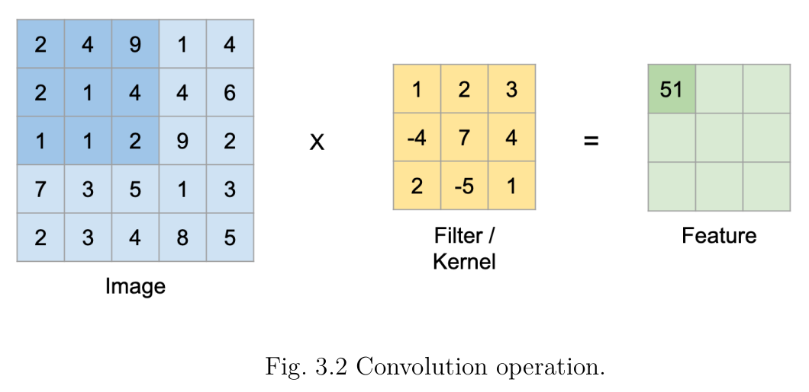

When consider the CNN network, the major operations are,
• Convolutional operation
• Pooling operation

In convolution operation, the input matrix is multiplied by the kernel. As shown in figure
3.2 the kernel needs to move through the whole input matrix based on the given stride
which defines how many columns or rows the kernel should move next. To move the
kernel through the whole matrix consumes time which slows down the operation. Im2col
technique can be used to overcome this problem which basically removes the need of
moving the kernel through the whole input matrix. We represent input matrices and
kernels using numpy matrices. So the implementation of the im2col technique is done
using the numpy strides. Which gave the ability to reshape the matrices in order to do
the convolution operation in a vectorized manner.
Using numpy strides each receptive field is turned into a column. As shown in the
figure 1.1 2x2 receptive field is converted to a column matrix and each kernel is reshaped
into a row matrix. Figure 3.3 shows the converted input matrix where each receptive
field is stacked side by side in a single matrix, Then the output is multiplied by the
kernel matrix which is reshaped into row matrices. For the pooling operation the same
procedure is used where for a given kernel shape input matrix is reshaped and gets the
output which depends on whether max pooling or average pooling.

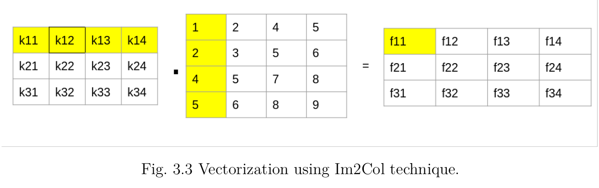

#### Computation Offloading

Most of the IoT devices have limited resources compared to the cloud. When it comes
to the AI and ML processing it requires more computation power and resources. Even
though the computation distribution, vectorization and parallelization techniques apply
some times it may not give the maximum benefits. We used offloading techniques to get
the advantage of more resource full servers.We compared the execution time in raspberry
pis with the execution time on the server and the communication delays based on that
we defined a policy to determine whether to offload or execute locally.

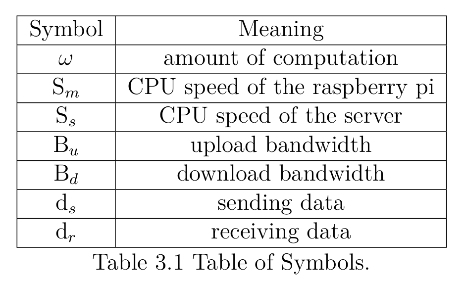

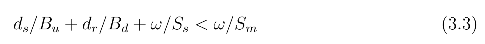

We compute the amount of computation using the number of floating point operations
and GFLOPs of the executing device. When multiplying to vectors of n elements there
involves 2n-1 arithmetic operations, then we divided it by the GFLOPs and compute
computation time. Then we use equation (3.3) with the communications delays to
determine the offloading decisions. As these IoT devices (Raspberry pies) have limited
amounts of memory we also considered the memory usage.

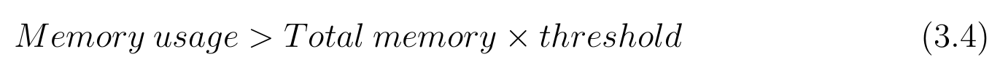

As shown in the equation (3.4), given a threshold value, we computed the memory
usage of the operation and if the above equation satisfies then we offload the computation
to the upper layers.

## Experiment Setup and Implementation
#### Prototype

In this work we choose object detection as our use case which needs high computation
power for the training and prediction phases. Raspberry pis are used as the end devices,
Which runs the YOLO algorithm. YOLO algorithm is based on convolutional neural
networks. Given an image, it feeds to an convolutional network and get an output based
on partitioning make on the image and number class. Figure 4.1 shows a input and output
example where 600x600x3 input is feed into the CNN where output is 19x19x425.In this
example number of predicting classes are 80 while 5 anchor boxes are used for each grid
cell.
The convolutional neural network consists of multiple filters in each layer so
by dividing kernels among multiple raspberry pis, the computation can be distributed
and parallelized. After computation done parallely then the output is merged and
forward to the next layer. We use the kernels with the shape of (h, w, nCprev, nC) where
the h and w represent the height and the width and the nCprev represent the number of
channels of the input matrix and the nC represent the number of kernel of the shape
of (h ,w, nCprev). So the computation distribution we partition the nCprev depending
on the available nodes and then perform the convolution on the input matrix and then
combine the each output of the each node.
For the pooling layers we distribute the input matrix between the available nodes
and perform the pooling operation. As shown in the figure 4.1 the master gets the input
image and it distributes the computation among the slave nodes.

Figure 4.1

Master acts as a client where the slave nodes act as servers. So we use client server
architecture to communicate between the slave nodes and the master nodes. Server nodes
are always listening to the incoming data , when the master node receives an image
then it distributes the computation to the slave nodes which are always listening for the
requests.
For convolution operations each node uses vectorization techniques and parallelization
techniques. For matrix implementation we used numpy matrices. For the vectorization
we used im2col technique and we got the advantage of numpy strides to manipulate the
matrices in order to perform the convolution operations in a vectorized manner.
Federated learning methods are used for the training network and object detection,
Where each raspberry pi or a raspberry pi cluster trains a model based on local data and
then the learned parameters are sent to higher layers (Fog, ROOF). Then the aggregation
done on that layer to train a global model.
For the data set we used We randomly captured these images of different scenes at
different times from 26 street monitoring videos with 704×576 pixels. Eventually, we
select a total of 2,544 items from these images with 7 object categories. Each image has
at least one labeled object, and may have multiple labels of this same category in one
image. The object labels are basket, carton, chair ,electromobile, gas tank,sunshade and
table.
while training YOLOv3 was via Adam with an initialization learning rate of 1e-3.
We adapt the original Federated Averaging (FedAvg) algorithm to framework, we
modified FedAvg algorithm to a pseudo FedAvg algorithm because there is an effect of
data division for the Federated learning

## Results and Analysis

#### Results

The Darknet’s different YOLO versions were instatiated on a single Raspberry Pi node.

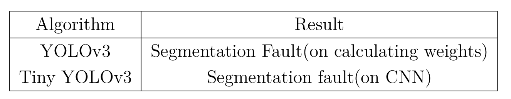

The Segmentation faults occur when the program tries to access memory beyond its
reach. That implies Darknet’s YOLO is computationally excessive for Raspberry Pi
devices. Also YOLOv3 stops at calculating weights while Tiny YOLOv3 stops at CNN.
Which shows optimized version can do better computation, but even Tiny YOLO can
not complete its task.
Then our custom YOLO implementation was tested on single node with Map reduced
version on multiple nodes.

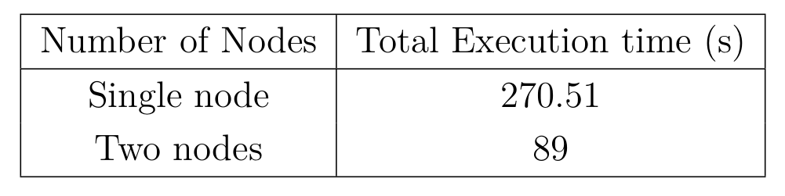

The distribution of computation with multiple nodes reduces execution time. After
the computation is divided among the cluster nodes using the Map Reduce techniques,
we used multi threads to utilize the resources.The computation is parallized within the
cores of each device.

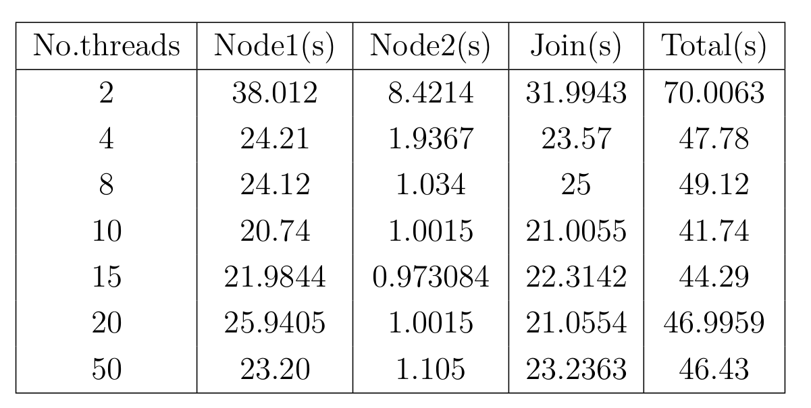

Here a variation of total execution time can be seen with respect to the number of
threads. Therefore to find the optimal number of number of threads the results were
tabulated.

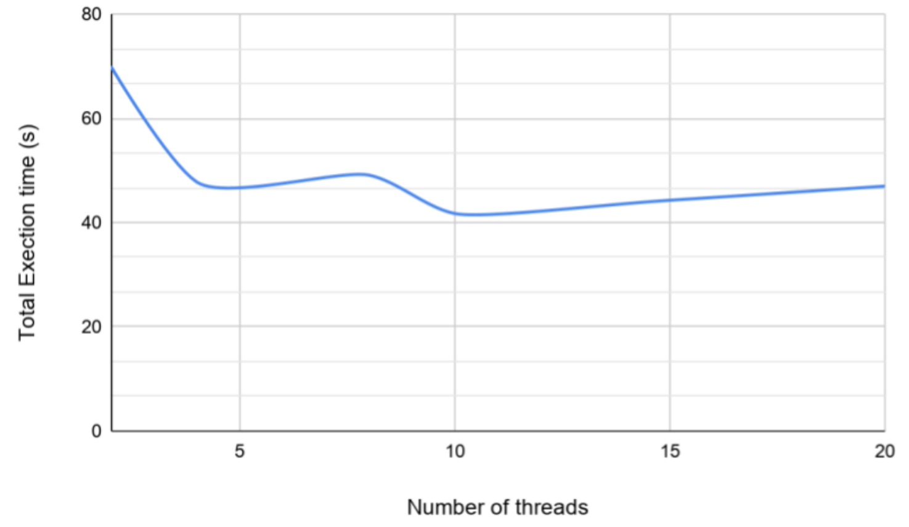
Fig. 5.1 Number of threads Vs the Total execution time

Here increasing the number of threads reduces the execution time. But after a point
the execution time increases, because the synchronization overhead happens in a limited
cores available environment. According to the diagram the optimal number of threads
per node is 10. Then the optimized code was compared with the same algorithm tested
on Cloud with very high resources.

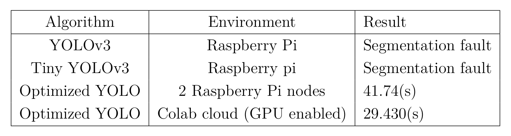

The resource utilization with multi threads was combined with the vectorization
approach and measured the performance gain in the distributed computation in raspberry
Pi.

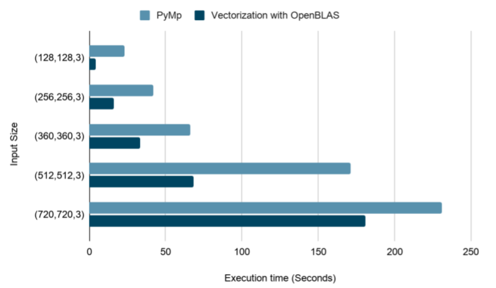
Fig. 5.2 Total execution time vs input size for Pymp multi threads and vectorization
with OpenBLAS optimization.

From figure 5.2 ,with the increase of the input size, the total execution time for
increases for both approaches. But for all the input sizes the vectorization optimized
with OpenBLAS performs better than as it utilizes the resources efficiently.This approach
further enables the real time computations.

We used the equation (3.3) to make offloading decisions in the raspberry pi. The
computation time is calculated using the GFLOPs in the given device. For the amount
of computation, the number of floating point operations in the given convolution is
considered and then it divided by the GFLOPs of the device. Fig. 5.3 shows the results
of the estimation with actual time.

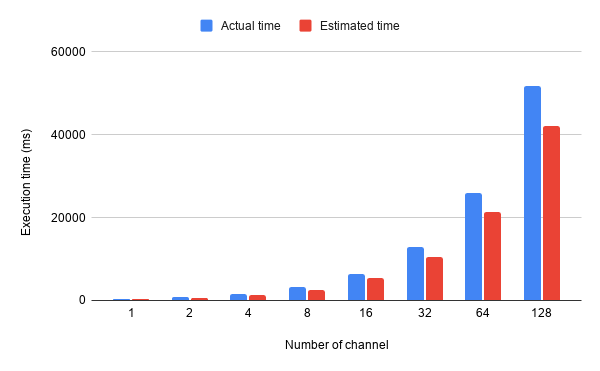
Fig. 5.3 Actual processing time vs Estimated processing time with the varying channel
size.Input matrix (64, 64, channels) with kernel shape (9, 9,channels, 256).

#### Analysis
Based on the results it is evident that the object detection algorithm we choose, YOLO
which has a complex Convolutional Neural Network cannot be run on a single raspberry
pi 3 board due to resource constraints. Both Darknet’s YOLO and Tiny YOLO cannot
perform their computations on a single Raspberry Pi board. We have implemented
a custom YOLO to run on a less-resourced environment. In a High resource enabled
environment like Google Colab Cloud. Also, This custom YOLO implementation can
be run on a single raspberry Pi board but the time for execution is comparatively high.
The custom implementation was focused on the core CNN computation of YOLO. In the Cloud environment, the GPU and CPU which have capabilities up to 12 GB YOLO perform in separate efficiency. We ran our custom optimized YOLO algorithm in the High computationally capable CPU and GPU.

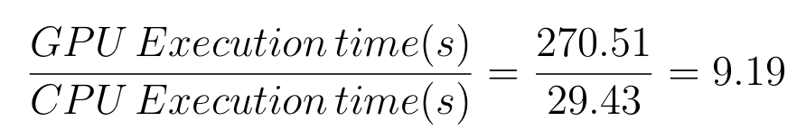

Our YOLO Object detection algorithm performs nearly 9 times better than in
GPU enabled cloud than Raspberry Pi. At the next instance, we implemented the
optimized algorithm in distributed cluster of Raspberry Pi nodes. Here we distributed
the computation to a cluster of two raspberry pi nodes. When the execution time in the
Colab cloud is compared with execution time is any raspberry Pi implementation Colab
cloud performs well. Because of the availability of high computational resources. But
the goal is to perform the complex CNN operations at the edge. So we have successfully
deployed our YOLO implementation which consists of the optimized CNN and performed
the tasks with the very constrained and resource-limited environment of the Raspberry
Pi.

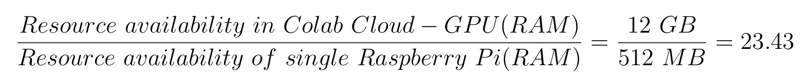

The reason YOLO performs better at the Colab Cloud is that Colab Loud provides
around 24 times better Computational resources compared to a single edge Raspberry Pi.
But our implementation of YOLO with the optimized CNN performed within around
270.51 seconds even in the very resource-constrained environment. Further, the optimized
YOLO algorithm was distributed to two parallel Raspberry Pis.

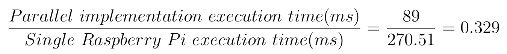

With the parallel implementation, the Execution time is reduced nearly by a factor
of two. This parallel implementation which distributes the computation among the Edge
nodes performs better even with the very constrained and limited resources available at the
edge devices. For further optimization, we used multi-threads to perform computation
utilizing each raspberry pi cores. To find the optimal number of threads to use we
tabulated the number of threads vs total execution time in Fig 5.1. The optimal number
of threads per raspberry pi node was 10. With the optimal number of threads applied
with the distributed computation using Map reduce we achieved the total execution time
to 41.74 seconds.

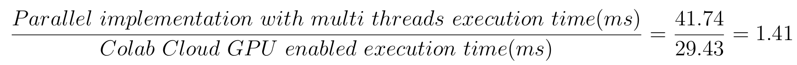

We could achieve nearly the same performance at edge when we apply distributed
computing together with optimization using multi threads. Furthermore we applied
vectorization for CNN which also improves the performance. Then to combine both
of these optimization techniques we used multi threads upon vectorized CNN. Here to
enable multi core resource utilization on raspberry pi when using vectorization, we used
the OpenBLAS, an optimized Basic Linear Algebra Subprograms library. From Fig Fig
5.2 we can see that for any given input size the execution time for vectorization with
OpenBLAS is less than multi threading with PyMP implementation. Therefore we used
vectorization with OpenBLAS for the core CNN computation of YOLO to enable real
time computations.

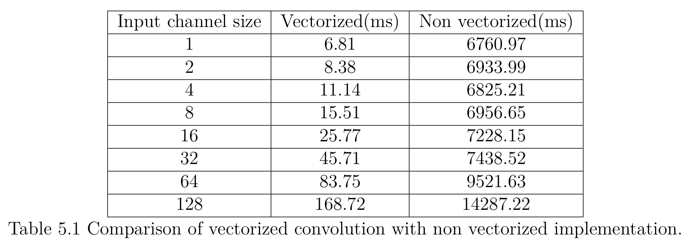

As previously explained we use the policy defined by the equation (3.3) to make the
offloading decisions. For that we needed to calculate the execution time on the raspberry
pis. We used GFLOPs based approach with the number of floating point operations to
calculate the execution time. Figure 5.3 shows the execution time with different input
matrices. Estimated times are shown in the red columns, when compare with the actual
execution time our GFLOPs based method was able to estimate the execution time close
to the actual execution time.
Table 5.1 shows the vectorized convolution execution time with the non vectorized
implementation.For the input matrix (64,64, channels) with the kernel shape (3,3,chan-
nels,256). There is a high improvement with the vectorization. When consider the
channel size of 128,

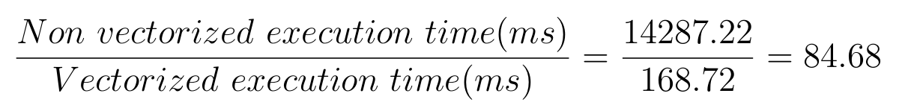

Vectorization improved the convolution operation by a factor of 85.

## Conclusion
The aim of the project is to enable real time processing at the edge with limited
resources.So with combining above mentioned techniques, real time processing at the
edge is achievable. In this study we have developed a distributed CNN using map reduce
which can be used to implement YOLO.Furthermore, we propose a novel approach where
end devices consisting limited resources can train and generate real time decision in
distributed manner, where their computations are distributed among other multiple
nodes or offload the computation to the upper layer when the resources run out. We
have distributed the CNN over multiple Raspberry Pis.The performance of the CNN has
been measured under different conditions and platforms. Based on the results it can be
concluded that by distributing CNN over multiple nodes the computation latency can be
reduced.Then we optimized our implementation using vectorization and multi threads
together so the execution time is reduced further enabling the real time computations
using limited resources.
Offloading decisions were taken using a policy where the computation time and
network transmissions delays were considered. Also we considered the memory usage for
the computation which also affected the offloading decisions. We also apply federated
learning to train a global model where each device is able to train a local model which
addresses the privacy issues. These techniques provide the path to achieve better results
using limited resource devices.

## Publications
1. [Semester 7 report](./data/sem7report.pdf)
2. [Semester 7 slides](./data/sem7presentation.pdf)
3. [Semester 8 report](./data/Semester8.pdf)
4. [Semester 8 slides](./data/Sem8Presentation.pdf)
5. Author 1, Author 2 and Author 3 "Research paper title" (2021). [PDF](./).

## Links

[//]: # ( NOTE: EDIT THIS LINKS WITH YOUR REPO DETAILS )

- [Project Repository](https://github.com/cepdnaclk/Real-Time-Data-processing-and-AI-for-Distributed-IoT)
- [Project Page](https://cepdnaclk.github.io/e15-4yp-Real-Time-Data-processing-and-AI-for-Distributed-IoT/)
- [Department of Computer Engineering](http://www.ce.pdn.ac.lk/)
- [University of Peradeniya](https://eng.pdn.ac.lk/)

[//]: # "Please refer this to learn more about Markdown syntax"
[//]: # "https://github.com/adam-p/markdown-here/wiki/Markdown-Cheatsheet"
