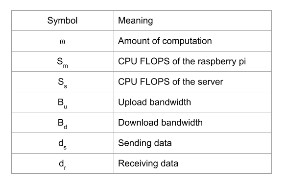

[comment]: # "This is the standard layout for the project, but you can clean this and use your own template"

# Real-Time Data processing and AI for Distributed IoT

#### Team

- E/15/246,Rajitha Opanayaka, [email](mailto:rajithaopanayaka.ro@gmail.com)
- E/15/385,Amila Weerasinghe, [email](mailto:amilaweerasinghe677@gmail.com)
- E/15/363, Rashmi Thilakarathne, [email](mailto:ireshe1996@gmail.com)

#### Supervisors

- Dr. Upul Jayasinghe, [email](mailto:upuljm@eng.pdn.ac.lk)
- Dr. Damayanthi Herath, [email](mailto:damayanthiherath@eng.pdn.ac.lk)

#### Table of content

1. [Abstract](#abstract)
2. [Related works](#related-works)
3. [Methodology](#methodology)
4. [Experiment Setup and Implementation](#experiment-setup-and-implementation)
5. [Results and Analysis](#results-and-analysis)
6. [Conclusion](#conclusion)
7. [Publications](#publications)
8. [Links](#links)

---

## Abstract
Artificial Intelligence has impacted in a variety of
industries, leading the world towards revolutionary applications
and services that are primarily driven by high-performance
computation and storage facilities in the cloud. This is mainly due
to the advantage of having higher computational power, larger
storage capacity and scalability. But with the increase of millions
of IoT devices, a huge amount of data is being generated by
end devices. To process such data, the distributed end devices
have to communicate with the cloud servers making it difficult
to generate real-time decisions though it consumes a lot of
resources including bandwidth, processing and storage facilities
at the cloud. On the other hand, Edge computing architectures
enable a distributed way to process data near the sources of
data which leads to facilitate real-time processing. But with the
limited resources in the end devices, it is quite challenging to
perform complex AI algorithms. Hence to facilitate such services
and to enable real time processing at the edge,a novel approach
is proposed base on computation distribution, vectorization,
computation offloading, parallelization and federated learning
techniques.

## Related works

## Methodology

#### Im2col Technique

In vectorization input matrices transform into a vector
representation where it enables the vector operations instead of scalar operations on the input data. We used vectorization
techniques in the convolution and pooling layers where we
use im2col technique to implement the vectorization. As
shown in figure 1 given the input matrix we take each window
and flatten them as columns and stack them as columns in a
matrix. Kernels are reshaped into rows then apply the matrix
multiplication between the row and column matrices.

#### Computation Offloading
Even though the horizontal distribution of computation
improves the performance, sometimes it may not be enough to
address the real time constraints. Servers have more resources
than the raspberry pi devices. So instead of doing the computa-
tion with limited resources, computation migration can be used
to address the real time constraints. In vertical distribution,
servers can execute the given task much faster than the limited
resource device. Even though there is an overhead in the
communication between the server and the node. Policies can
be used to determine whether to offload the computation or
perform the computation locally. Network bandwidth, node
processing power and server processing power and the amount
of data that transfer between the server node and limited
resource node can be used to define a policy.
Raspberry pies also have a limited amount of memory. So
the memory consumption also needs to be considered in the
offloading decisions.

## Experiment Setup and Implementation

## Results and Analysis

## Conclusion

## Publications
1. [Semester 7 report](./)
2. [Semester 7 slides](./)
3. [Semester 8 report](./)
4. [Semester 8 slides](./)
5. Author 1, Author 2 and Author 3 "Research paper title" (2021). [PDF](./).

## Links

[//]: # ( NOTE: EDIT THIS LINKS WITH YOUR REPO DETAILS )

- [Project Repository](https://github.com/cepdnaclk/Real-Time-Data-processing-and-AI-for-Distributed-IoT)
- [Project Page](https://cepdnaclk.github.io/e15-4yp-Real-Time-Data-processing-and-AI-for-Distributed-IoT/)
- [Department of Computer Engineering](http://www.ce.pdn.ac.lk/)
- [University of Peradeniya](https://eng.pdn.ac.lk/)

[//]: # "Please refer this to learn more about Markdown syntax"
[//]: # "https://github.com/adam-p/markdown-here/wiki/Markdown-Cheatsheet"
